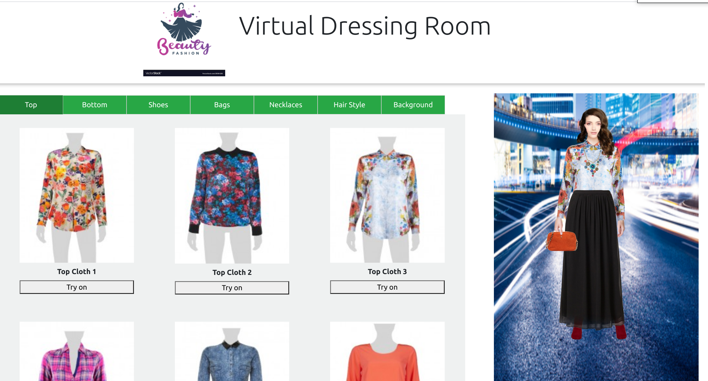

# Getting Started with Create React App

This project was bootstrapped with [Create React App](https://github.com/facebook/create-react-app).

## Project Description

-   The user can try on different clothes virtually by clicking the try-on button.
-   After the try-on button is clicked, the item will move across the web page from the drawer to be fitted on the model in the dressing room.

## Features

-   Written in modern React, only functional components with hooks.
-   Used state management Redux.
-   Used React Spring for animation.

## Available Scripts

In the project directory, you can run:

### `yarn start`

Runs the app in the development mode.\
Open [http://localhost:3000](http://localhost:3000) to view it in the browser.

## Project View

