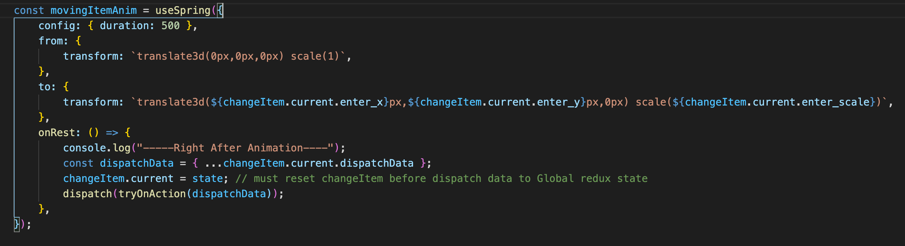

# Getting Started with Create React App

This project was bootstrapped with [Create React App](https://github.com/facebook/create-react-app).

## Project Description

Virtual Dressing Room is a easy-to-use web application tool to try-on clothes and accessories virtually. This is a unique site that
allow users to visually see their chosen items on the model.

## Project Demo

[Click to view demo] (https://19-virtual-dressing-room.vercel.app/)

## Technologies

- JavaScript (ES6)
- HTML5
- CSS3
- React.js - version 17.0.2
- React-DOM - version 17.0.2
- React-Scripts - version 4.0.3
- React-Spring - version 9.1.2
- Redux.js - version 4.1.0

## Features

- Written in modern React, only functional components with hooks.
- Used state management Redux.
- Used React Spring for animation.
- Users can click on each tab to try-on different accessories and see how it looks on the model
- Users can see the animation of each item moving across the page to fit on the model.

## Setup

To try out this project:

1. Clone the GitHub repository locally to your computer
2. In the command line, navigate to the root directory of the repository, and type the following: $ npm install
3. Navigate to the client folder, and in the root directory of the client folder, type the following: $ npm install
4. In the client folder, and in the root directory of the client folder, type the following: $ npm start

## Code Examples

## Inspiration

The inspiration for Virtual Dressing Room came as I online shopping but they don't have the feature of try-on different clothing items together with accessories. With the increase in online shopping, I wanted to develop a virtual dressing website that allowed shoppers to easily try-on different items in the store in a easy-to-use format that allows shopping to be fun and creative.
